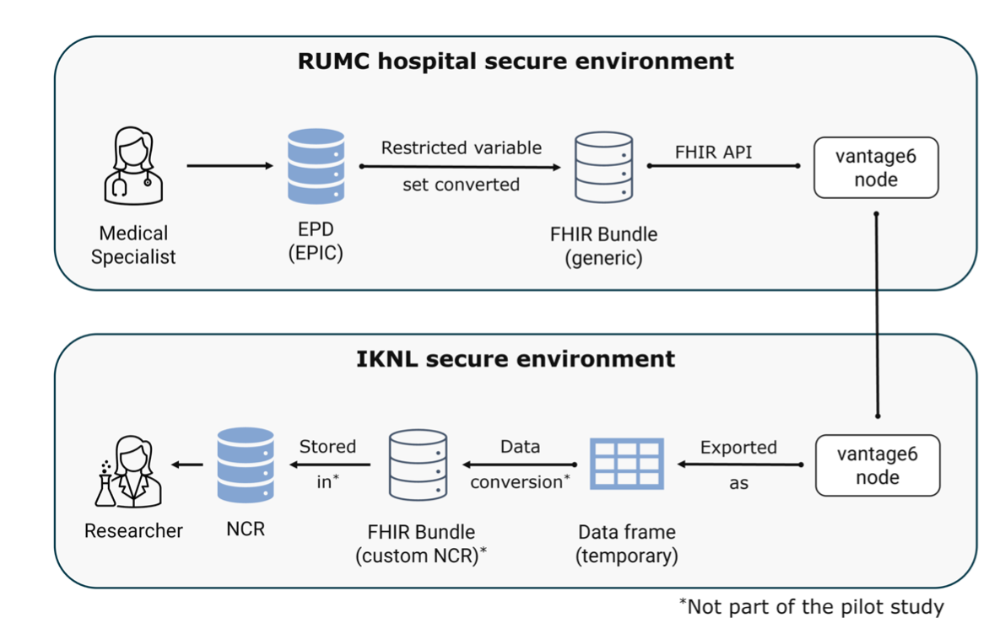

# Runtime View {#sec-runtime-view}

## Data beschikbaar maken

- *\<voeg een runtime diagram of een tekstuele beschrijving van het scenario toe\>*

- *\<voeg een beschrijving toe van bijzondere aspecten van de interactie tussen de instanties van de bouwstenen die in dit diagram worden weergegeven\>*

## Gefedereerd leren

```{=html}
<likec4-view
   view-id="federated-learning"
   dynamic-variant="sequence">
</likec4-view>
```

Voor gefedereerd leren maakt PLUGIN gebruik van vantage6. Het gefedereerd leren van een algoritme omvat een reeks gecoördineerde stappen tussen de data gebruiker, de centrale server en de datastations. Dit proces is ontworpen om de analyse uit te voeren zonder dat de brongegevens de lokale omgeving van het datastation verlaten. Hieronder volgt een detailleerde beschrijving wat elk van de applicatiecomponenten hierin doen.

::: {.list-table}
- - Stap
  - Omschrijving

- - **1. Authenticatie**
  - De onderzoeker start het proces door te authenticeren bij de centrale Vantage6-server.

- - **2. Taak specificatie**
  - Na succesvolle authenticatie definieert de onderzoeker een taak. Hierbij wordt opgegeven:
    *   Welk algoritme (Docker-image) gebruikt moet worden.
    *   Specifieke inputparameters voor de analyse.
    *   Het aantal iteraties (indien van toepassing, voor machine learning).
    *   De identiteit van de *Centrale Aggregatie Server* (CAS), de node die verantwoordelijk is voor het aggregeren van resultaten.

- - **3. Verzending naar nodes**
  - De centrale server stuurt de taak door naar de betrokken nodes. De CAS ontvangt het verzoek als eerste.

- - **4. Start hoofdalgoritme (CAS)**
  - De CAS downloadt het Docker-image, start het hoofd-algoritme en orkestreert de subtaken die door de datastations uitgevoerd moeten worden.

- - **5. Start subtaken (datastations)**
  - De datastations ontvangen hun subtaak van de centrale server, downloaden hetzelfde Docker-image en starten het lokale deel van het algoritme. De analyse wordt uitgevoerd op de lokale data.

- - **6. Verzending lokale resultaten**
  - Na elke trainingscyclus of analysestap stuurt het algoritme op het datastation de lokale resultaten (bijv. modelgewichten of statistische coëfficiënten) naar de CAS. De brongegevens verlaten het datastation niet.

- - **7. Verificatie en aggregatie**
  - De SAS verifieert de resultaten, extraheert de metadata van de resultaten en voegt de resultaten van alle datastations samen tot een geaggregeerd tussenmodel. Dit voltooit één iteratie.

- - **8. Vervolg-iteraties**
  - Voor vervolgstappen vragen de datastations de geaggregeerde resultaten van de vorige ronde op bij de CAS om hun lokale modellen verder te trainen. Deze cyclus herhaalt zich totdat het model convergeert of het gewenste aantal iteraties is bereikt.

- - **9. Afronding**
  - De CAS informeert de onderzoeker dat de taak is voltooid. De onderzoeker kan vervolgens het finale, globale model downloaden van de server. Gedurende het proces heeft niemand, ook de onderzoeker niet, toegang tot de tussenresultaten, wat de veiligheid waarborgt.
:::

## Data aanlevering

In de eerste versie van PLUGIN is voor data aanlevering gebruik gemaakt van vantage6. De _runtime_ view voor deze usecase is dus hetzelfde zoals hierboven beschreven, met dien verstande dat er geen centrale aggregatie functie wordt gebruikt. Onderstaand diagram geeft een vereenvoudige weergave van deze usecase. 

TO DO: add reference to draft paper.



## Data analytics

```{=html}
<likec4-view
   view-id="federated-analytics"
   dynamic-variant="sequence">
</likec4-view>
```

De federated analytics functionaliteit is op dit moment (mei 2026) in ontwikkeling. Belangrijk uitgangspunt is dat [NUTS](https://nuts-node.readthedocs.io/en/stable/#) als framework wordt gebruikt voor decentrale authorisatie en authenticatie. Het architectuur zal op basis van de ervaringen van de eerste implementatie worden gereviewed en waar nodig aangepast c.q. verbeterd. Zodra de NUTS integratie in PLUGIN is gerealiseerd, zal de usecase voor data aanlevering gebruik maken van de functionaliteit van gefedereerde analyse, in plaats van de huidige implementatie gebaseerd op gefedereerd leren.

::: {.list-table}

- - Stap
  - Omschrijving

- - **1. Inloggen**
  - ...

 - - **2. Data of analyse aanvraag**
   - ...

- - **3. Validatie credentials via Nuts profiel**
  - ...

- - **4 .Credentials geldig**
  - ...

- - **5. Federatief verzoek met Nuts credentials**
  - ...

- - **6. Validatie credentials Processing Hub**
  - ...

- - **7. Credentials geldig**
  - ...

- - **8. Terugkoppelen data of query resultaten**
  - ...

- - **9. Aggregatie en statistische integriteitscontrole**
  - ...

- - **10. Geaggregeerd resultaat**
  - ...

- - **11. Resultaat inzien**
  - ...

:::